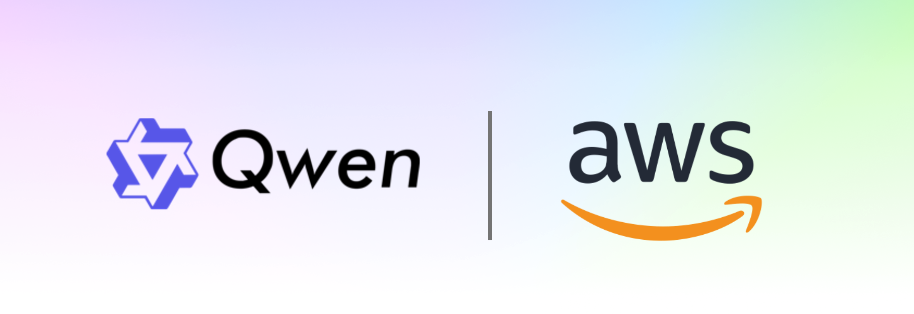

# Qwen on AWS Examples

Welcome to the **Qwen on AWS** repository! This collection provides notebooks and examples to get started with Qwen models on AWS. Explore practical tutorials for deploying, fine-tuning, and building applications using Alibaba's Qwen family models on Amazon SageMaker, Amazon Bedrock, and other AWS services. Contributions welcome!

---------
## What's New

- 🎉 **Sep 2025**: Added Qwen3-Next-80B-A3B-Instruct deployment with vLLM BYOC on SageMaker

---------
## Security

See [CONTRIBUTING](CONTRIBUTING.md#security-issue-notifications) for more information.

## License

This library is licensed under the MIT-0 License. See the LICENSE file.

